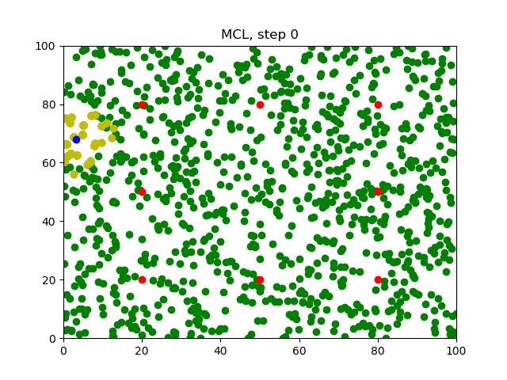
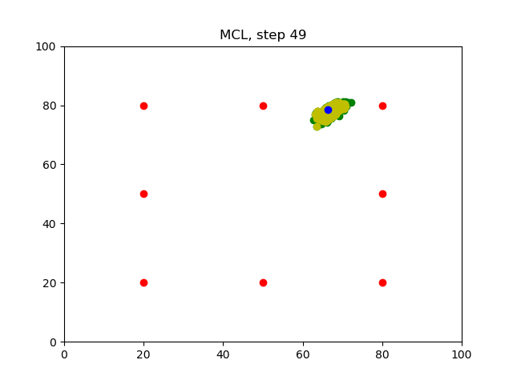

# Monte-Carlo-Localization
You will be able to observe the `MCL` in action through the generated images. 

### Compiling the Program
```sh
$ git clone https://github.com/adheeshc/Monte_Carlo_Localization.git
$ rm -rf Images/*
$ g++ main.cpp -o app -std=c++11 -I/usr/include/python2.7 -lpython2.7
```

### Running the Program
Before you run the program, make sure the `Images` folder is empty!
```sh
$ ./app
```
### Results
Wait for the program to iterate `50` times. After running the program, `50` images will be generated in the `Images` folder.
The images will also be shown while training. If you wish to improve training speed, remove line 222 plt::pause(0.1) and see the results directly after training.

### Generated Images
#### Step0

#### Step49


